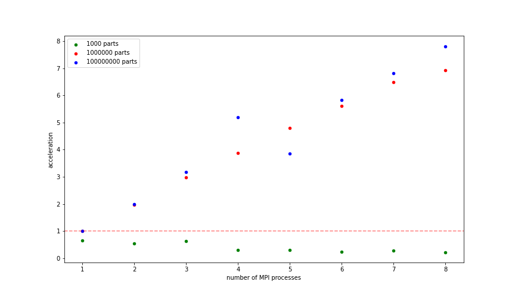

# MPI Integral Computer

- [The Task itself](https://gitlab.com/fpmi-atp/pd2021-supplementary/global/-/blob/master/homeworks/task1_mpi.md)

## Outline

The main task of this project is to compute the integral

$$\int\limits_0^1\frac{4}{1+x^2}dx$$

on the a one node and then distribute the computation to the
different nodes and measure an acceleration.

## Report



Detailed report can be found in [report.ipynb](./results/report.ipynb) jupyter notebook.

## Prerequisites

- [OpenMPI](https://www.open-mpi.org/doc/) distribution
- CMake
- Access to the cluster running [Slurm Workload Manager](https://slurm.schedmd.com/documentation.html) (optional)
- Ansible (optional)

## Build

Do the following in the root repository folder:

```bash
mkdir build && cd build
cmake ..
make
```

## Running

### Run locally
```bash
mpiexec -n 4 ./bin/count-integral 123 0
```

### Run on cluster

- Install ansible
```bash
pip3 install -r requirements.txt
```

- Change `ansible/hosts` file with your host and password
```
remote ansible_host=USER@calc.cod.phystech.edu ansible_ssh_pass=PASS
```

- Run playbook
  - The playbook will prompt you to continue when slurm jobs are finished (you can check this on cluster by running `squeue` command)
```bash
ansible-playbook -i ansible/hosts ansible/run-bench.yml
```

- When playbook finished, data will appear in the `result.csv` file.
